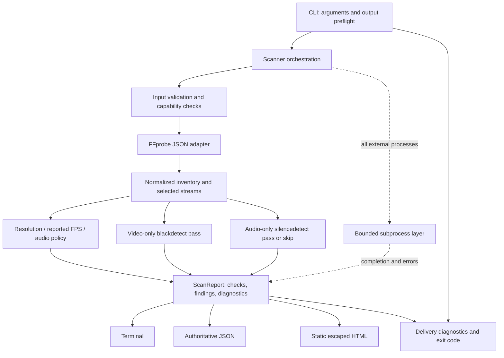

# FrameGuard v0.1 — proposed architecture and contracts

**Status:** DRAFT, pending owner approval and M0 evidence. This document accompanies [planning-review.md](planning-review.md); RC-01–RC-12 and approval choices A1–A4 are part of its contract. No interfaces here have been implemented or tested.

## Scope and alternatives

The package analyzes one local exported video without modifying it, selecting one video/audio stream, collecting native measurements, applying explicit expectations, and rendering an evidence report. Choose a thin standard-library package. Typer plus Pydantic is a reasonable convenience alternative but adds runtime dependencies. A combined filter pass reduces some I/O but couples failure and complicates event attribution. OpenCV/PyAV-based analysis brings unnecessary decoding/backends and changes semantics. Separate native passes and explicit data/functions are the recommended v0.1 design.

## Data flow

A filesystem destination error prevents analysis when detectable during preflight. An output race/failure after analysis affects CLI delivery, not media severity. No network or telemetry exists. Diagram nodes are responsibilities, not a request for one class/module per node.

## Files and boundaries

| File | Responsibility and public interface |
|---|---|
| src/frameguard/__init__.py | Installed version retrieval, no scan side effects at import. |
| models.py | Dataclasses/enums below, explicit configuration validation, finite JSON projection. |
| process.py | Discover tools, execute bounded jobs, drain streams, parse callbacks, terminate/reap, normalize errors. No media policy. |
| probe.py | FFprobe invocation/JSON normalization, inventory and deterministic selection; no detector logic. |
| checks/metadata.py | Pure resolution/FPS/audio-presence functions operating on normalized metadata. |
| checks/black.py | Video command builder, filter-attributed event parser and interval normalization. |
| checks/silence.py | Audio command builder, filter-attributed state-machine parser and interval normalization. |
| scanner.py | Preconditions, dependency skips, independent checks, timing, final status and report. |
| reporting.py | report_to_dict, terminal, JSON, HTML, no-clobber file publication; no analysis logic. Split only if real size warrants it. |
| cli.py | argparse, safe paths/destination preflight, invoke scanner, render/export, concise expected-error diagnostics, exit code. |

Use simple pure functions plus small stateful parser objects where necessary. No check superclass, plugin registry, generic dependency graph, database, or backend service. Test-only dependency injection supplies a runner/capabilities without exposing advanced CLI options.

## Model contract

JSON values are null, bool, integer, finite float, string, arrays, or string-keyed objects. Dataclasses do not enforce types: normalizers and validate_config must do so. Enums serialize their values. Units are explicit in names; unknown never becomes zero. JSON rejects NaN/Infinity (`allow_nan=False`). Schema and tool versions are independent; schema starts 0.1.0. Document the JSON field contract in docs/report-schema.md, not a second runtime model.

| Model | Required fields and semantics |
|---|---|
| ScanConfig | expect_width/int-or-null, expect_height/int-or-null, expect_fps/Fraction-or-null plus original input text, require_audio/bool, black_min_duration_seconds=0.5, black_picture_ratio=0.98, black_pixel_threshold=0.10, silence_min_duration_seconds=2.0, silence_noise_db=-60.0, analysis_timeout_seconds=600.0. Validate dimensions >0, rates positive/finite/nonzero denominator, durations finite >0, silence duration <=86400 (native limit), noise finite <=0, timeout finite >0. Keep report destinations outside analysis config. |
| InputInfo | display_name/basename, size_bytes/int-or-null. Absolute path and raw argv are not serialized. Internal resolved Path/stat identity stays outside report. |
| StreamMetadata | index/int, codec_type/string, codec_name/string-or-null, disposition_default/bool, attached_pic/bool, width/height/int-or-null, pixel_format/string-or-null, avg_frame_rate/raw-string-or-null, r_frame_rate/raw-string-or-null, parsed average Fraction-or-null, start_time_seconds/float-or-null, duration_seconds/float-or-null, time_base/raw-string-or-null, rotation_degrees/float-or-null, rotation_source/string-or-null, sample_aspect_ratio/display_aspect_ratio/raw-string-or-null, sample_rate_hz/int-or-null, channels/int-or-null, channel_layout/string-or-null. Type-specific fields null for other stream types. |
| MediaMetadata | format_name/string-or-null, duration_seconds/float-or-null, size_bytes/int-or-null, bit_rate_bps/int-or-null, start_time_seconds/float-or-null, streams/list[StreamMetadata], selected_video_index/int-or-null, selected_audio_index/int-or-null, selection_reason/string, uninspected_stream_indexes/list[int]. Filesystem size and container size retain separate provenance. |
| Timeline | basis=`media_relative` or `source_pts`, origin_seconds/float-or-null, origin_source=`format_start_time`, `selected_stream_starts`, or `unknown`, limitations/list[string]. No independent per-stream time reset. |
| ToolVersions | ffmpeg_version/string-or-null, ffprobe_version/string-or-null, capabilities/list[string]; capture first version lines, not full build command/path. |
| Diagnostic | code/string, message/string, check_id/string-or-null; path-redacted, bounded, expected failure details. Raw stderr is not authoritative evidence or included wholesale. |
| CheckResult | check_id/string, status=`completed`/`skipped`/`failed`, reason_code/string-or-null, reason/string-or-null, required/bool, selected_stream_index/int-or-null, diagnostics/list[Diagnostic], limitations/list[string]. Completed means measurement/policy ran reliably, NOT “no findings.” |
| Interval | start_seconds/finite-float, end_seconds/finite-float-or-null, duration_seconds/finite-float-or-null, raw_start_seconds/finite-float, raw_end_seconds/finite-float-or-null, endpoint_basis=`detector_reported`/`open`, endpoint_precision_note/string-or-null. Common-origin subtraction affects start/end, not duration. |
| Finding | code/string, severity=`info`/`warning`/`critical`, title/string, explanation/string, check_id/string, stream_index/int-or-null, interval/Interval-or-null, actual/JSON-value, expected/JSON-value, provisional/bool, human_review_recommended/bool. Missing actual/expected values serialize null. |
| ScanReport | schema_version, tool_version, input/InputInfo, media_metadata/MediaMetadata-or-null, configuration/JSON-projection of ScanConfig, timeline/Timeline, checks/list[CheckResult], findings/list[Finding], diagnostics/list[Diagnostic], overall_status=`pass`/`warn`/`fail`/`incomplete`, analysis_duration_seconds/finite-float, tool_versions/ToolVersions. |
| ProcessSpec / ProcessResult | Spec: argv/list[str], timeout_seconds/float, stdout_limit_bytes/int, diagnostic_limit_bytes/int, line_limit_bytes/int, event_callback/Callable[[str],None]-or-null. Result: returncode/int-or-null, stdout/bytes bounded, diagnostic_tail/bytes bounded, timed_out/bool, output_limit_exceeded/bool, elapsed_seconds/float, cancelled/bool. Result is not itself a successful-check verdict. |
| Toolchain / ProbeResult | Toolchain contains internal executable Paths, versions, validated capabilities. ProbeResult contains metadata-or-null and diagnostics; unsuccessful probe has metadata=null. Neither reports executable absolute paths. |

Malformed optional fields normalize to null with a bounded metadata diagnostic; absent optional fields require no diagnostic. Malformed structural inventory, duplicate indexes, or missing required stream identity fail probing. Reject nonfinite numbers, negative durations/sizes, zero dimensions and invalid rates as unavailable, not invented facts. Unknown stream types can remain inventoried. Probe output should request relevant fields/tags rather than unbounded chapter/tag payloads.

## Function interfaces

The proposed signatures are the coordination contract for roadmap tasks. Runner means `Callable[[ProcessSpec], ProcessResult]`; `run_process` implements it. Parser callbacks consume every decoded bounded stderr line, not merely the retained diagnostic tail, and latch `decode_error_detected: bool` when a validated attributable decode-error record is observed. That sticky state survives diagnostic-tail rotation and is consulted by the owning check's completion verdict. `BlackParser` and `SilenceParser` expose `feed(line: str) -> None` and `finish(process: ProcessResult, timeline: Timeline) -> tuple[list[Interval], list[Diagnostic]]`; malformed qualifying events make their owning CheckResult failed.

Core functions are `validate_config(config: ScanConfig) -> None` (raises ConfigError); `discover_tools() -> Toolchain` (raises DependencyError); `run_process(spec: ProcessSpec) -> ProcessResult`; `probe_media(path: Path, tools: Toolchain, runner: Runner) -> ProbeResult`; `normalize_probe(payload: dict) -> MediaMetadata`; `choose_streams(metadata: MediaMetadata) -> MediaMetadata`; `choose_timeline(metadata: MediaMetadata) -> Timeline`; and `scan(path: Path, config: ScanConfig, *, runner: Runner = run_process, tools: Toolchain | None = None) -> ScanReport`.

Each check returns `tuple[CheckResult, list[Finding]]`: `check_resolution(metadata: MediaMetadata, config: ScanConfig)`, `check_frame_rate(metadata: MediaMetadata, config: ScanConfig)`, `check_audio_presence(metadata: MediaMetadata, config: ScanConfig)`, `detect_black(path: Path, metadata: MediaMetadata, config: ScanConfig, timeline: Timeline, tools: Toolchain, runner: Runner)`, and `detect_silence` with the same detector arguments. `calculate_status(checks: list[CheckResult], findings: list[Finding]) -> str` owns precedence. `report_to_dict(report: ScanReport) -> dict`, `render_terminal(report: ScanReport) -> str`, `render_json(report: ScanReport) -> str`, `render_html(report: ScanReport) -> str`, `publish_report(path: Path, content: str) -> None` (raises OutputError), `exit_code(report: ScanReport | None, *, execution_error: bool) -> int`, and `main(argv: list[str] | None = None) -> int` are the delivery layer. ConfigError/DependencyError/OutputError are typed expected errors with stable codes and safe messages; media/process errors normally become diagnostics in ScanReport.

## Selection, metadata policy, and findings

Inventory all streams. Real video excludes attached pictures/cover art and requires an identifiable video codec stream; choose default-disposition real video then lowest absolute index. Choose default-disposition audio then lowest index. Multiple defaults are resolved by lowest index. Do not switch to a different stream after failure. Map exact absolute indexes as `0:<index>` in native passes. Record every uninspected stream, including alternate A/V tracks, in reports. No stream-selection flag or all-stream claim in MVP.

Resolution compares only supplied expected coded dimensions and reports RESOLUTION_MISMATCH/critical with expected and actual objects. Rotation is recorded from display-matrix side data preferentially, legacy rotate tags second; conflicts become metadata diagnostics. Width/height do not change to display-oriented values. Anamorphic and non-right-angle rotation limitations are displayed, not guessed.

Frame rate uses only avg_frame_rate as the documented comparison source. Convert decimal input with Fraction from its string, not a binary float. Valid source values such as 30000/1001 are exact internally; abs(actual-expected) <= Fraction(1,1000) passes. 29.97 versus 30000/1001 passes; 30 versus 30000/1001 fails. Missing average rate with a supplied expectation fails the check as unavailable. No expectation means skipped/not configured regardless of rate availability; both raw rate fields still appear in metadata. Use FPS_MISMATCH/critical; never infer VFR from differing fields.

Audio presence inventories all audio streams. Required missing audio gives AUDIO_REQUIRED_MISSING/critical; optional missing audio gives AUDIO_ABSENT/info. Silence without audio is skipped/no_audio and required=false, not passed or failed. Existing selected audio means silence required=true; all channels of that stream must be below the configured sample threshold collectively, not a downmix or RMS computation.

Black and silence emit BLACK_INTERVAL/warning and SILENCE_INTERVAL/warning, human_review_recommended=true. A detected interval is not an editorial defect. Metadata expectation violations are objectively technical and need not assert that the creator's intent was wrong. Stable check IDs are input_validation, dependencies, probe, resolution, frame_rate, audio_presence, black, silence. Findings from a failed detector are retained only as provisional=true, accompanied by failure diagnostics; no report implies that partial coverage is complete.

## Status, diagnostics, and exit contract

Prerequisite failures mark their CheckResult failed/required=true; downstream checks are skipped/prerequisite_failed, so failure remains visible. Unconfigured expectation checks and truly inapplicable silence checks are legitimate skips/required=false. M1 black/silence not yet implemented are failed/required=true when applicable, reason feature_not_implemented, making early inspection explicitly incomplete.

Status precedence is incomplete if any required check failed (or was skipped for a nonlegitimate reason); otherwise fail if nonprovisional critical findings exist; otherwise warn if nonprovisional warnings exist; otherwise pass. Info alone does not change pass. An incomplete scan can still show critical evidence, but is never labeled fully analyzed. Return code is 2 for configuration/execution/output errors or incomplete report, 1 for completed fail, otherwise 0. Warning-only complete scan is 0. Keyboard interruption gets controlled diagnostic/cleanup and exit 2 under the MVP contract; document this rather than allowing an uncontrolled traceback.

Expected missing/unreadable/unsupported input is a failed input/probe diagnostic, not a critical media-quality finding. When valid options/destinations allow it, create JSON/HTML failure reports too, with nullable metadata and skipped dependencies. Argparse syntax errors occur before ScanReport exists. Unexpected programming bugs remain observable in tests; the CLI boundary may emit a concise internal-error diagnostic without leaking paths, but must not silently swallow them into a pass.

## Native process and event integration

M0 validates the exact argv before it becomes production behavior. Candidate probe shape is FFprobe with bounded JSON show_format/show_streams and explicit relevant entries. Restrict initial self-contained inputs to the MOV/MP4 demuxer (`-f mov`), file-only protocols, and external data references disabled (`-enable_drefs 0`, `-use_absolute_path 0`) if those options/capabilities are validated on the supported floor. Do not accept user-provided filtergraphs, protocol strings, or executable fragments. If safe demuxer restrictions cannot be established, stop for owner review; do not downgrade offline requirements.

Candidate detector jobs use -nostdin, -hide_banner, -nostats, info log level, -copyts, -noautorotate, validated local input options, exact stream map, only that media type's filter, and null output. Black filter is blackdetect=d=0.5:pic_th=0.98:pix_th=0.10; silence is silencedetect=n=-60dB:d=2 with mono=false. Require validated -xerror behavior on supported binaries to fail on reported decode errors, retain the parser's sticky attributable decode-error state independently of the diagnostic tail, and test passthrough/no-frame-resampling options. A zero return code cannot override that latched failure; a build lacking the validated error behavior fails the dependency gate. The native logs, not null-output frame counts or progress, supply detector measurements. Do not add -shortest, seeking, truncation, a CFR rate override, downmix, or resampling as an invisible shortcut. The command is a hypothesis until M0 evidence confirms timing and failure behavior.

Use argv arrays, shell=false, stdin=DEVNULL, inherited environment minus FFREPORT and forced no log colors, strict timeouts, concurrent pipe drains, bounded incremental parsing, and controlled terminate then kill/reap (two-second grace). Initial proposed constants are tool/capability timeout 10 seconds, probe timeout 30 seconds, detector timeout 600 seconds each (CLI override applies to each detector), probe stdout cap 8 MiB, diagnostic tail 1 MiB, event-line cap 64 KiB, total findings 10,000. Diagnostic-tail rotation is allowed and disclosed; truncating authoritative JSON/events/findings is not. Exceeding such a cap fails the affected check and sets incomplete. These are operational defaults, not a speed promise or a total memory/CPU sandbox.

Treat stderr as mixed events and diagnostics. Attribute event lines to the relevant filter prefix/instance rather than matching arbitrary metadata text containing black_start or silence_start. One instance per job simplifies attribution. Accept signed finite timestamps and scientific notation on validated builds; reject nonfinite/missing timestamps, reversed ends, inconsistent durations outside log-rounding tolerance, duplicate/unmatched silence events, and truncated matching event lines. Non-event banner/diagnostic lines are not parse errors. Absence of events is a valid zero-finding result only after validated successful completion and no parser/detected decode failure. A start lacking an end retains end/duration=null, but prevents completed status unless the installed-build limitation is explicitly approved and documented.

Current source black EOF endpoint is last-frame PTS rather than true media end, and native minimum duration can hide a near-threshold trailing interval. Under A1, retain the native endpoint/duration and a black-check-wide limitation explaining possible EOF understatement/misses. Do not label every ordinary closed event as exact or infer which event is EOF from container duration. Current silence source emits teardown closure at audio-frame end; qualify it only after successful completion. Metadata-only parsing is not the default because teardown closure has no corresponding frame metadata. Full-frame endpoint recovery is a separate approved design if A1 is rejected.

## Timestamp convention

Prefer preserving filter input PTS with a validated copyts invocation. Common origin is finite container start_time if available; otherwise the minimum finite start_time across all selected A/V streams if each selected stream has a known start; otherwise origin=null and basis=source_pts. Retain origin provenance. Never use reported duration as absolute end or independently setpts/asetpts both streams to zero. Normalize display timestamps as raw PTS minus the shared origin; allow finite negative values and explain preroll rather than clamping. Raw-source mode is labeled prominently and is not a promise of player-seek timestamps.

M0 must test differing starts, negative starts, VFR, unknown origins, and an explicit MOV/MP4 edit-list fixture whose stored edit-list structure and decoded frame/sample PTS are independently verified on the floor/newer builds. An offset fixture alone is not edit-list evidence. If copyts/log PTS semantics are unreliable for a case, preserve observed raw timestamps only if their meaning is established; otherwise fail the time-based check with a diagnostic. This does not claim exhaustive detection of every timestamp discontinuity: an undetected pacing irregularity is outside MVP scope, and all reports explain that limitation. Unknown file duration alone need not fail completed decoding or metadata checks.

## Report safety, consistency, and testing

JSON is UTF-8, deterministic key/order policy, rational rates serialized as raw/normalized strings, finite times rounded to six decimal places; rounding is display precision, not detection accuracy. Sort findings by severity (critical, warning, info), check ID, interval start, stream index, then code for stable semantic comparisons. analysis_duration_seconds is monotonic elapsed runtime, deliberately volatile. HTML groups findings by severity, prints accessible labeled tables/intervals, configuration, selected/uninspected streams, timeline basis/limitations, and completed/skipped/failed reasons. Inline CSS only; no JavaScript/network assets. Escape all metadata/text; never turn file names or arbitrary tags into executable markup/URLs. Terminal sanitizes control/ANSI characters while preserving readable Unicode.

Preflight reports before decoding, resolve input and output identity, reject input aliases including hardlinks/symlinks, reject pre-existing destinations and same JSON/HTML targets, and validate parent existence. Publication must be no-clobber at the final creation step, not check-then-overwrite; test collision races. A same-directory temporary plus atomic no-replace publication is preferred on tested platforms; if exclusive creation is used as a fallback, explicitly document cleanup/partial-write semantics and never claim atomicity. Do not chmod a source file to make it readable. Recheck source identity/size/mtime before/after execution; observed change makes analysis incomplete. This is race detection, not a guarantee against every concurrent edit.

Unit tests use normalized payloads, parser log snippets and fake runners, independent of FFmpeg. Real-FFmpeg tests generate tiny controlled clips and compare decoded ground truth within documented tolerances. Installed-wheel CLI tests run outside the checkout. FFmpeg compatibility, process termination, report races, and offline/reference rejection require integration evidence. See [acceptance-tests.md](acceptance-tests.md) for FR coverage and [risk-register.md](risk-register.md) for approval gates. Record pinned tool builds and M0 observations in a validation report before treating candidate commands as accepted contracts.

